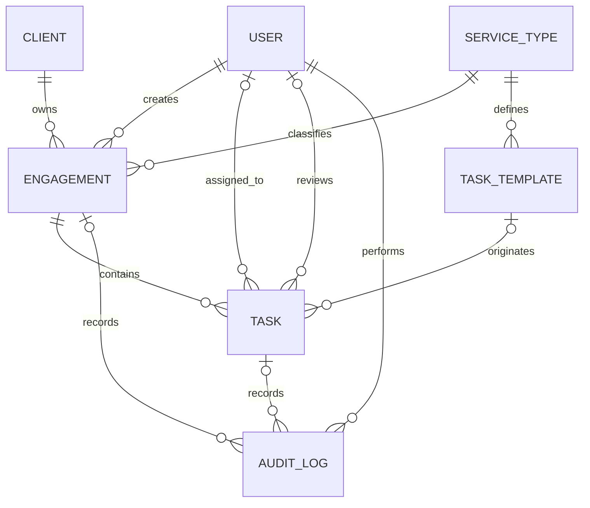

# Technical Design Note

## Submission Record

| Item                | Location / Value                                                                                               |
| ------------------- | -------------------------------------------------------------------------------------------------------------- |
| Working application | Run locally at `http://localhost:3000` after following the root README. No hosted URL is currently configured. |
| Source code         | This repository. Add its remote URL to the root README before external submission.                             |
| Demo credentials    | `rahul.manager@example.com` / `Password123!` (manager); `amit@example.com` / `Password123!` (team member).     |
| Setup instructions  | Root `README.md`                                                                                               |

---

## Architecture

The system is a TypeScript monorepo containing a Next.js/React client and a separate Express API. The browser communicates with the API over JSON/HTTP using a Bearer JWT. The API uses Prisma to access PostgreSQL.

The backend is the authority for request validation, authorization, workflow rules, recurring engagement generation, and persistence.

```text
Next.js Client
      │
      │ HTTP + Bearer JWT
      ▼
Express API
      │
      ├── Routes
      ├── Controllers
      ├── Zod Validators
      └── Services
             │
             │ Prisma
             ▼
       PostgreSQL
```

### Frontend

The client uses Next.js App Router, React, and TypeScript.

Authentication state is provided through `AuthProvider`, while API requests are centralized in `src/lib/api.ts`. Authenticated pages cover:

* Dashboard
* Clients
* Users
* Service Types
* Task Templates
* Engagements
* Tasks

The frontend provides navigation, input handling, filtering, pagination, and user feedback. It is not treated as a security boundary; authorization is enforced by the backend.

### Backend

Express exposes API resources for:

```text
/api/auth
/api/users
/api/clients
/api/service-types
/api/task-templates
/api/engagements
/api/tasks
/api/dashboard
```

The backend also exposes health/status endpoints for process and database checks.

Environment-specific configuration is supplied outside source control, including:

```text
DATABASE_URL
DIRECT_URL
JWT_SECRET
PORT
CLIENT_URL
```

The frontend uses:

```text
NEXT_PUBLIC_API_URL
```

to identify the backend API.

The current database architecture uses PostgreSQL through the selected Supabase PostgreSQL instance. No specific production hosting arrangement is claimed here because a live deployment has not been configured in the repository.

---

## Database Schema / ERD

The database contains the six core domain entities required by the assignment, plus an `AuditLog` entity for basic history tracking.

All primary keys are UUID strings.



| Entity         | Key relationships and important fields                                                                                                                                           |
| -------------- | -------------------------------------------------------------------------------------------------------------------------------------------------------------------------------- |
| `User`         | `id` PK; unique `email`; `role` enum (`ADMIN`, `MANAGER`, `TEAM_MEMBER`); `isActive` flag. Creates engagements and may be an assignee, reviewer, or audit actor.                 |
| `Client`       | `id` PK; `isActive` flag; owns many engagements.                                                                                                                                 |
| `ServiceType`  | `id` PK; unique `name`; recurrence flag and optional monthly/quarterly/yearly interval; owns templates and engagements.                                                          |
| `TaskTemplate` | `id` PK; `serviceTypeId` FK; defines the task structure used when engagements generate tasks. Unique (`serviceTypeId`, `sequence`) fixes the template ordering within a service. |
| `Engagement`   | `id` PK; `clientId`, `serviceTypeId`, and `createdById` FKs; nullable `period` identifies a recurring instance; owns tasks and engagement audit logs.                            |
| `Task`         | `id` PK; `engagementId` required FK; optional `templateId`, `assignedToId`, and `reviewerId` FKs; contains status and due date.                                                  |
| `AuditLog`     | `id` PK; required `userId` FK; optional task/engagement FKs; records actions, status changes, notes, and timestamps.                                                             |

### Integrity Constraints

The schema enforces:

* unique `User.email`
* unique `ServiceType.name`
* unique (`serviceTypeId`, `sequence`) for task templates
* unique (`clientId`, `serviceTypeId`, `period`) for engagements

The engagement constraint is named:

```text
uniq_client_service_period
```

`period` is nullable because one-time engagements do not require a recurrence period.

For recurring engagements, the application validates the period format according to the service interval:

```text
Monthly   → YYYY-MM
Quarterly → YYYY-QN
Yearly    → YYYY
```

PostgreSQL treats `NULL` values as distinct for unique constraints. Consequently, the database constraint prevents duplicate populated recurring periods while allowing multiple one-time engagements with `period = NULL`. The service layer performs an explicit duplicate check as part of engagement creation as well.

Users and clients use `isActive` flags rather than requiring hard deletion, preserving historical relationships.

### Indexes

Indexes currently support common access paths:

**User**

* `role`

**Client**

* `name`

**TaskTemplate**

* `serviceTypeId`

**Engagement**

* `clientId`
* `serviceTypeId`
* `status`
* `dueDate`

**Task**

* `assignedToId`
* `status`
* `dueDate`
* `engagementId`
* (`assignedToId`, `status`)

**AuditLog**

* `taskId`
* `engagementId`
* `createdAt`

These indexes support common filtering and lookup operations for task assignment, task status, due dates, engagements, dashboard metrics, and audit history.

---

## Backend Design

The backend follows a layered request flow:

```text
Route
  ↓
Authentication / Authorization Middleware
  ↓
Controller
  ↓
Zod Validation
  ↓
Service
  ↓
Prisma
  ↓
PostgreSQL
```

Routes attach authentication and coarse role restrictions.

Controllers handle HTTP concerns:

* path/query/body extraction
* request validation
* service invocation
* HTTP response formatting
* mapping known domain errors to status codes

Services contain the main domain rules and Prisma operations. This keeps business rules independent from the web UI and means future API clients are subject to the same rules.

Examples of service-owned logic include:

* date and period validation
* active client/assignee checks
* template-to-task copying
* duplicate recurrence checks
* task state transitions
* review decisions
* audit-log creation

Known failures are represented with appropriate HTTP responses:

| Situation                       | HTTP status |
| ------------------------------- | ----------: |
| Invalid request/workflow input  |       `400` |
| Unauthenticated                 |       `401` |
| Forbidden operation             |       `403` |
| Missing resource                |       `404` |
| Duplicate/conflicting operation |       `409` |
| Unexpected server failure       |       `500` |

Engagement creation and next-period generation run inside Prisma transactions. The transaction includes engagement creation, generated task creation, and audit logging, so an error during the operation prevents the partial unit of work from being committed.

---

## Authentication and Authorization

Authentication uses JWTs and bcrypt.

During login:

1. the request is validated;
2. the email is normalized;
3. the stored bcrypt password hash is checked;
4. inactive users are rejected;
5. a signed JWT containing the user identity and role is issued.

The JWT currently has a 24-hour expiry.

`requireAuth` verifies the Bearer token and attaches the authenticated user to the request. `requireRole` provides route-level role restrictions, while services perform additional resource-level authorization.

### Role model

| Role        | Responsibilities                                                                                    |
| ----------- | --------------------------------------------------------------------------------------------------- |
| Admin       | Manage users and clients; manage service types and task templates; access engagements and tasks     |
| Manager     | Create/manage engagements; assign/reassign tasks; manage deadlines; review submitted work           |
| Team Member | View assigned tasks; update permitted statuses; wait for client information; submit work for review |

Authorization is enforced server-side.

For example:

* only authorized management roles can assign/reassign tasks;
* task assignment accepts active Team Member users;
* Team Members can only access their assigned task set;
* Team Members cannot update another Team Member's task;
* engagement generation is manager-only;
* review operations are restricted to the manager review workflow;
* a manager cannot review their own assigned task.

Frontend visibility is therefore treated as a usability feature rather than the security mechanism.

---

## Recurring Engagement and Task Generation

A `ServiceType` defines whether a service is recurring and, when recurring, which interval it follows.

When an engagement is created, the service's task templates are loaded in sequence order and copied into tasks belonging to the new engagement.

For example:

```text
Service Type
     │
     ├── Template 1
     ├── Template 2
     └── Template 3
             │
             ▼
       New Engagement
             │
             ├── Task 1
             ├── Task 2
             └── Task 3
```

The generated tasks retain their source template reference where applicable.

### Next-period generation

`generateNextEngagement`:

1. loads the current engagement and its service type;
2. verifies that the service is recurring;
3. validates the current period;
4. calculates the next period;
5. loads the service's current task templates;
6. checks for an existing engagement for the client/service/next period;
7. creates the next engagement;
8. creates its generated tasks;
9. records the generation in the audit log.

The operation is performed in one Prisma transaction.

Examples:

```text
2026-09 → 2026-10
2026-Q3 → 2026-Q4
2026    → 2027
```

### Duplicate prevention

Duplicate recurring engagements are prevented at two levels.

**Service layer**

The application checks whether the next-period engagement already exists before attempting creation and returns a conflict when it does.

**Database layer**

The composite uniqueness constraint:

```text
(clientId, serviceTypeId, period)
```

provides database-level protection for populated recurring periods, including concurrent attempts to create the same recurring engagement.

Repeating a successful generation therefore results in a conflict rather than another engagement for the same client, service, and period.

Because engagement creation, generated tasks, and audit logging occur in one transaction, failure during task or audit creation rolls back the transaction rather than leaving a partially generated engagement.

---

## Workflow Rules

Tasks use the following statuses:

```text
NOT_STARTED
      │
      ▼
IN_PROGRESS
   │       │
   │       └──────────► WAITING_FOR_CLIENT
   │                         │
   │                         └──► IN_PROGRESS
   │
   └──────────────────► READY_FOR_REVIEW
                              │
                     ┌────────┴────────┐
                     ▼                 ▼
             CHANGES_REQUESTED     COMPLETED
                     │
                     ▼
                IN_PROGRESS
```

The primary workflow is:

```text
NOT_STARTED
     ↓
IN_PROGRESS
     ↓
READY_FOR_REVIEW
     ↓
COMPLETED
```

Additional supported paths are:

```text
IN_PROGRESS
     ↓
WAITING_FOR_CLIENT
     ↓
IN_PROGRESS
```

and:

```text
READY_FOR_REVIEW
     ↓
CHANGES_REQUESTED
     ↓
IN_PROGRESS
```

Only the assigned Team Member can perform the permitted status transitions for their task.

The backend rejects invalid transitions, including directly completing an in-progress task.

Review is handled separately from ordinary Team Member status updates. A manager can approve a task that is `READY_FOR_REVIEW` or request changes. A manager cannot review their own task.

Status changes and review decisions are recorded through audit entries so that the system retains basic workflow history.

---

## Dashboard

The dashboard exposes the five required metrics:

* Open Tasks
* Overdue
* Due Today
* Waiting for Client
* Waiting for Review

The backend scopes dashboard results according to the authenticated user's role.

Team Members receive metrics for tasks assigned to them, while management roles can access the broader task set.

The task endpoint also supports filtering and pagination, allowing the dashboard and task screens to avoid retrieving the entire task collection.

---

## Automated Tests

The current backend test suite contains:

**4 test files — 25 tests — 25 passed.**

The test suite uses Vitest and Supertest.

| Test file                 |  Tests | Coverage                                        |
| ------------------------- | -----: | ----------------------------------------------- |
| `auth.test.ts`            |      5 | Authentication and RBAC                         |
| `dashboard.test.ts`       |      3 | Dashboard access and metrics                    |
| `engagement.test.ts`      |      3 | Recurring engagement behavior                   |
| `task-assignment.test.ts` |     14 | Assignment, authorization, workflow, pagination |
| **Total**                 | **25** |                                                 |

The suite covers:

* protected routes rejecting unauthenticated requests
* invalid login requests
* user-route role restrictions
* manager/team-member dashboard behavior
* task assignment authorization
* task ownership checks
* valid task workflow transitions
* invalid workflow transitions
* waiting-for-client and resume behavior
* task submission for review
* manager approval
* manager change requests
* resuming after requested changes
* self-review prevention
* task pagination metadata
* duplicate recurring engagement prevention
* next-period recurring engagement generation
* Team Member denial of recurring engagement generation

The assignment requires at least three automated backend tests; the implementation provides 25 passing tests across the major security, workflow, dashboard, assignment, pagination, and recurrence paths.

---

## Production Considerations at 5 Million Tasks

The current implementation is appropriate for the assignment's scope. At approximately 5 million tasks, several areas would require further scaling work.

### Database and indexes

The existing indexes provide a starting point for common access paths.

Additional composite or partial indexes should be introduced based on actual production query plans rather than indexing every possible field.

For example, dashboard queries over open or overdue tasks may benefit from specialized indexes if measurements show that the current indexes are insufficient.

### Pagination

The current task API uses offset/page-based pagination.

For very large and frequently changing task lists, cursor/keyset pagination could be introduced using a stable ordering such as:

```text
(dueDate, id)
```

or:

```text
(createdAt, id)
```

This can avoid increasingly expensive large offsets.

### Recurring generation

Recurring engagement generation is currently exposed as an application operation.

At larger scale, this could be moved into a scheduled background-job system:

```text
Scheduler
    ↓
Durable Queue
    ↓
Worker
    ↓
Generate Engagement + Tasks
```

A production implementation should support retries and idempotency. The existing engagement uniqueness constraint would remain the final database-level safeguard against duplicate recurring periods.

### Dashboard queries

Dashboard metrics currently use database aggregation.

At sustained high load, possible optimizations include:

* query/index optimization
* cached aggregates
* materialized views
* asynchronously maintained rollups

The appropriate choice depends on the required freshness of dashboard metrics.

### Logging and monitoring

Production monitoring should include:

* structured application logs
* request IDs
* API latency metrics
* database latency/error metrics
* transaction failure monitoring
* background-job monitoring
* authentication/authorization failure monitoring
* health-check monitoring

Sensitive information such as passwords, JWTs, and database connection strings should not be logged.

---

## Decisions and Trade-offs

### 1. PostgreSQL + Prisma

PostgreSQL fits the relational nature of the domain, which contains multiple foreign-key relationships, uniqueness requirements, and transactional multi-record operations.

Prisma provides type-safe database access and supports the transactions required by engagement and task generation.

**Trade-off:** the ORM adds an abstraction layer and requires migration/schema discipline, but improves consistency and developer productivity for this application's domain.

### 2. Backend-enforced business rules

Workflow, ownership, authorization, and recurrence rules are centralized in backend services.

This prevents the browser or another API client from bypassing business constraints.

**Trade-off:** it introduces a service layer and additional validation logic, but keeps controllers thin and makes the rules independently testable.

### 3. Transactional generation + database uniqueness

Recurring engagement generation uses a database transaction combined with the composite engagement uniqueness constraint.

This ensures that multi-step generation either completes as a unit or rolls back, while the database constraint provides an additional safeguard against duplicate recurring periods.

**Trade-off:** template copying occurs inside a transaction, so unusually large template sets should be monitored and, if necessary at greater scale, moved to an asynchronous job workflow.

---

## Implementation Scope

The current implementation covers the core assignment requirements:

* authentication
* role-based authorization
* user management
* client management
* service types
* task templates
* engagement creation
* automatic task generation from templates
* recurring engagement generation
* duplicate prevention
* task assignment/reassignment
* task deadlines
* task workflow enforcement
* manager review
* changes-requested workflow
* dashboard metrics
* audit/history records
* task filtering and pagination
* automated backend tests

The project intentionally does not claim functionality that has not been implemented, such as a hosted production deployment or an already-running background-job infrastructure.

The design therefore distinguishes between the **implemented system** and **recommended production-scale extensions**.
